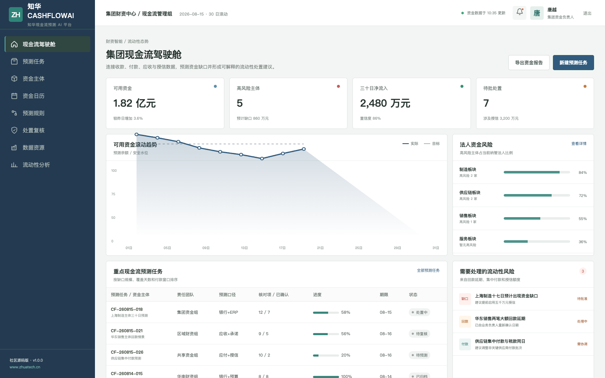
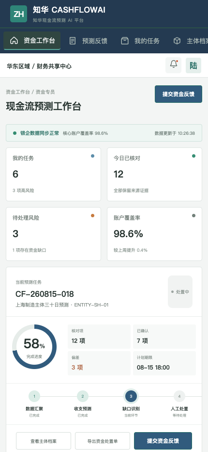

# 知华现金流预测 AI

> ZhuaTech CashflowAI — 面向中小企业与集团财资团队的滚动预测社区源码。

| 项目属性 | 内容 |
| --- | --- |
| 发布方 | [知华科技（上海如静知华信息科技有限公司）](https://www.zhuatech.cn/) |
| 架构 | Vue 3 管理端/H5 + Java 21 Spring Boot API + MySQL 8 |
| Java 包名 | `cn.zhuatech.cashflowai` |
| AI 方式 | 本地、可测试、可解释，不依赖外部模型密钥 |
| 使用范围 | 仅限个人非商业学习交流，商业使用需书面授权 |

## 产品视图



集团驾驶舱将可用资金、高风险主体、30 日净流入、授信处置、余额趋势和法人风险放在同一视图，方便资金负责人判断流动性优先级。



H5 工作台用于核对回款承诺、付款变化、授信安排和资金缺口，支持主体档案、账户状态、处置反馈和风险升级。

## 预测逻辑

社区版接口 `POST /api/ai/cashflow/forecast` 接收期初资金、未来 30 天收付款、逾期应收、已承诺授信与预测置信度，返回：

1. 预计期末资金和可用流动性；
2. 资金缺口及现金覆盖天数；
3. 风险分值、风险等级和主要驱动；
4. 回款、付款节奏或授信提款建议。

关键付款、授信提款和融资决定必须由有权限的资金负责人审批。更完整的接口与生产接入边界见 [docs/api.md](docs/api.md)和 [docs/architecture.md](docs/architecture.md)。

## 工程内容

- JWT 登录、角色权限、任务、反馈、复核与数据资源接口
- Vue 3 专业管理驾驶舱和响应式移动工作台
- JPA、MySQL、Flyway、H2 集成测试与 Docker Compose
- 银企直连、ERP、应收应付和授信平台的扩展接入位置
- 单元测试与 API 集成测试覆盖核心预测规则

## 五分钟看演示

```bash
cd frontend
npm install
npm run dev:demo
```

打开 `http://localhost:5173`。管理端账号 `planner / Demo@2026`，H5 账号 `operator / Demo@2026`。示例资金余额、公司主体、账户和回款数据均为虚构内容，不代表任何真实客户。

## 授权说明

本工程仅能用于个人、非商业性的学习、研究和技术交流，**不得商用**。企业内部使用、生产部署、SaaS、收费服务、项目交付、品牌替换或二次销售，均须取得上海如静知华信息科技有限公司书面授权，完整条款见 [LICENSE](LICENSE)。

现金流预测、财资系统、银企直连、ERP 对接和软件项目外包，请访问[知华科技官网](https://www.zhuatech.cn/)或扫码咨询：

| 财资技术咨询 | 商业授权与项目合作 |
| --- | --- |
|  |  |

版权所有 © 2026 上海如静知华信息科技有限公司。

搜索关键词：现金流预测 AI、财资管理、流动性预警、银企直连、企业资金管理、Java 财务系统源码、知华科技。
